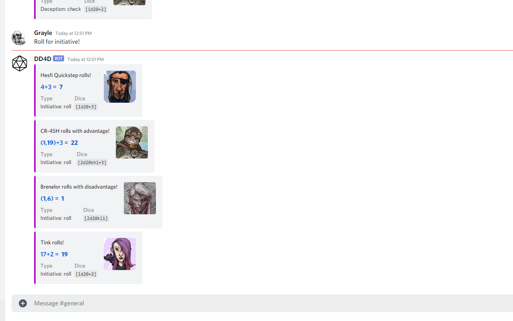
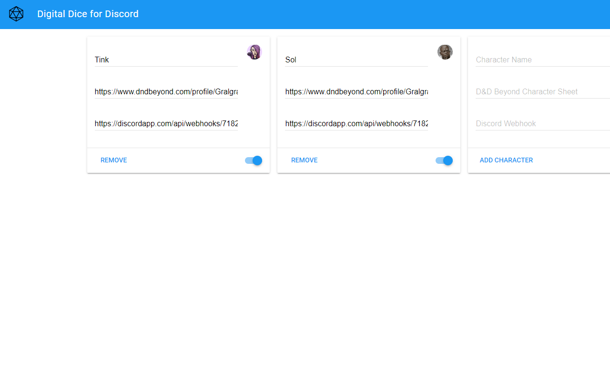
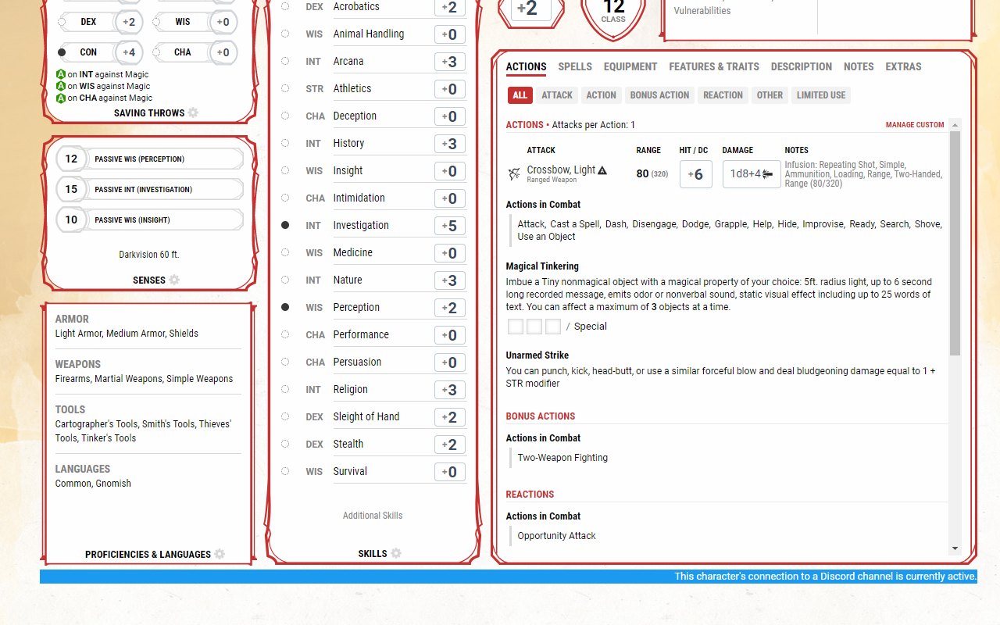
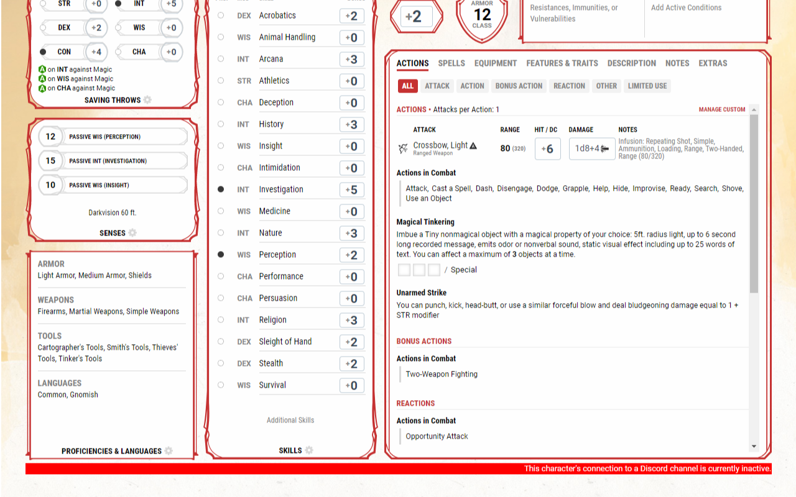

##### This is a simple Extension which allows you to send your Digital Dice rolls from your D&D Beyond character sheet to a Discord channel.

Developer nstallation:
1. Download this repo and unzip it
2. Go to chrome://extensions and enable "developer mode" (top right toggle)
3. Click "Load unpacked" in the top left and select the "src" folder inside this repo
4. The extension's settings page should automatically open, if not: click the small dice icon that's appeared in the top right of your 
Chrome browser.
5. Ask your DM to set up a webhook for the channel you'll be playing in (https://support.discord.com/hc/en-us/articles/228383668-Intro-to-Webhooks&amp?page=3).
6. Fill in all the fields
7. Hit "Add character"
8. Open or go to your character sheet in D&D Beyond, make sure you've enabled dice rolling (click your avatar, at the 
bottom of that menu should be a toggle)
9. Roll some dice!

You can also toggle the "Active" state. A character present in this extension's settings will have either a red or 
blue bar at the bottom of their character sheet depending on its active state. If it's red, no rolls will be sent to 
Discord. If it's blue, they will be sent. If you don't see a bar at all, that character hasn't been connected to 
Discord yet (or something has gone wrong).

