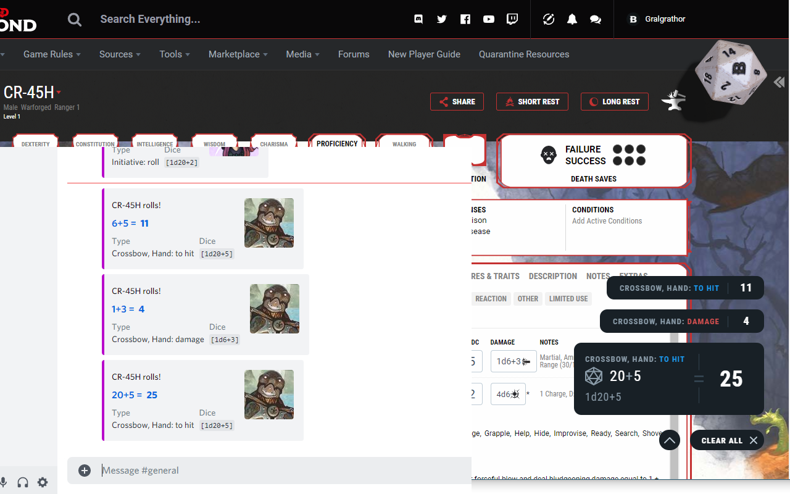

# Digital Dice for Discord
>Lets you send your rolls on a D&D Beyond character sheet to a Discord channel. 

Integrates D&D Beyond's Digital Dice on your character sheet with Discord*.

Once the extension has installed, it will add a small dice icon in the top right of your browser. Clicking that will 
open the settings page where you can manage your characters. That page will automatically open after installation as 
well.

Enter name, character sheet, and Discord webhook* for the channel to send your rolls to and hit "Add character". 
That's it, ready to roll. You can disconnect your character from Discord by using the toggle, or completely remove 
your character from this extension by clicking "Remove".

Now with support for the newly added "advantage/disadvantage" rolling on dndbeyond!

(\*) This extension is not affiliated with WotC, D&D Beyond or Discord. It is meant to integrate their stuff 
though so I kind of have to mention them.  
(\*\*) Request a webhook for the Discord channel you'll be playing in from the Discord channel administrator 
(https://support.discord.com/hc/en-us/articles/228383668-Intro-to-Webhooks)

-----------------------------------------------------------------------

- Easy to setup. It is singular in its goal, and that goal does not require a lot of setup.
- Connect multiple characters to different (or the same) Discord channel at once, for those multi-campaigners among us.
- All it requires is a Discord webhook, or really any link that can accept POST requests and can handle Discord's 'embed' structure.
- Unobtrusive. A small banner that shows that character's connection status is all that's visibly different on your character sheet.
- Set and forget. No need to activate it every time you close your browser or want to play a session.
- Syncs its settings across your browsers, switch from laptop to desktop easily.
- Free!

-----------------------------------------------------------------------
## Installation

### Chrome

Head on over to the [Chrome Web Store](https://chrome.google.com/webstore/detail/digital-dice-for-discord/oihhmjdpffiifofgmhkjimhnbfhelinm) and click "Add to Chrome"!

### Developer installation:
1. [Download this repo](https://github.com/nick-vanpraet/dndbeyonddigitaldicefordiscord/archive/master.zip) and unzip it
2. Go to chrome://extensions and enable "developer mode" (top right toggle)
3. Click "Load unpacked" in the top left and select the "src" folder inside this repo

## FAQ

Q: Why this and not Beyond20?  
A: Simplicity. If *all* you want is to send your rolls to Discord, this one is easier to set up and you can quickly 
connect multiple characters to multiple channels. That's it though, so if you want more options or don't mind the 
initial setup Beyond20 is probably better.

Q: What about Avrae?  
A: That is currently a Discord bot, and though you can use it to type "roll !stealth" and it will use your character's 
stats, you can't click the fancy digital dice on dndbeyond.com and have that result sent to your Discord channel. Yet. 
I'm sure they are working on it and when that day comes this extension will be obsolete.

## Images

